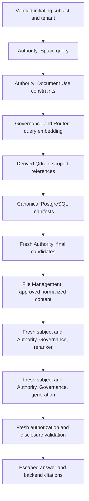

# RAG authorization flow

## Independent Document decisions

| Operation | Protected fact/output | Does not imply |
| --- | --- | --- |
| discover | List entry, identity/title and safe citation attribution | read, download, use, quote, manage |
| read | Approved normalized Version text | original download, use or quote |
| download | Original verified Asset bytes | read, use, quote or manage |
| use | Content as an authorized AI/retrieval input | discover, download or verbatim quote |
| quote | Controlled verbatim source disclosure | discover, download or manage |
| manage | Resource/version/membership mutation | read, download, use or quote |

Only Authority interprets grants/roles/ALL/CRUD/ACL/classification/ownership/scope/hierarchy/temporal denies. Callers supply factual attributes and receive the final decision. Cache hits, knowledge membership, PostgreSQL RLS and UI operation hints grant no permission. ALL does not bypass tenant, classification, explicit deny or invalid identity boundaries.

## Concurrent change and failure

The original HUMAN Session and authorization version are checked when durable content work resumes and immediately before each provider dispatch. Candidate facts/version/membership are compared against canonical immutable chunk proofs. Rerank/generation/publication checkpoints reject revocation or changed classification. Document publication locks and Job leases prevent stale worker commits. Missing or stale facts produce safe errors and metadata-only evidence, with no hidden source counts/title/chunk text.

Expired transfer staging is different from content work: a registered PLATFORM_SERVICE with the explicit `Files.Transfers.expire` grant may abort expired, uncommitted multipart uploads. It never materializes/publishes/purges a committed Asset. A readable ambiguous candidate remains UNRESOLVED for authorized reconciliation. The original initiator is preserved separately in Audit.

Evidence: Authority conformance and `t44-authority-live.integration.test.ts`; RAG security checkpoints and hidden-source/disclosure tests; cache/range permission tests; machine expiry and Worker recovery tests. Actual customer policy/grant configuration requires separate verification.
